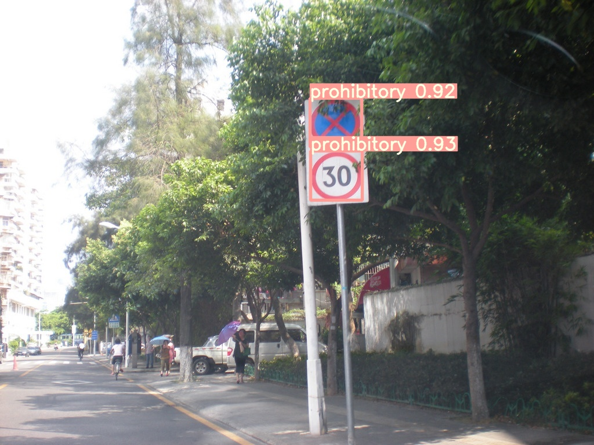

# Traffic_Sign_Recognition
Use yolov5 for traffic sign detection
Recently I am interested in doing some work related to autonomous driving, so I will try various methods to try to do work related to autonomous driving. This time I did traffic sign detection. The data set used was CCTSDB, which was obtained by Changsha University of Science and Technology expanded on the basis of the CTSDB data set. At present, Baidu Cloud Disk has uploaded 15,000 pictures, and the size of the pictures does not agree. The proportion of traffic signs has changed a lot. In fact, it is a hodgepodge of different data sets. With some data sets collected by them, traffic signs are currently only divided into three major categories, and there is no small classification.

This article is based on yolov5 for identification detection, the original version is: [yoloV5](https://github.com/ultralytics/yolov5)

## How to run 
### step 1:Data preprocessing
download data from baidu cloud,[CCTSDB](https://pan.baidu.com/s/1OE7D4RBYbJ-tb-6JTFnzKg) [qqkm],and put it into `data/`
```bash
#split the dataset
$ python  make_text.py
#change data format from VOC to yoloV5
$ python  voc_label.py
```
creat a new yaml file on your data,such as

### step 2:model trainning
download pretrain model：[yolov5s.pt](https://pan.baidu.com/s/1OE7D4RBYbJ-tb-6JTFnzKg) [qqkm],and put it into `weights/`.
```bash
$ cd yolov5-master
$ sh train.sh
```
### step 3:model test
```bash
$ python test.py --weights runs/train/exp15/weights/best.pt --data data/CCTSDB.yaml --img 640
```
### step 4:Inference
```bash
$ python detect.py --source test_imgs --weights runs/train/exp15/weights/best.pt --conf 0.25--weights runs/train/exp15/weights/best.pt
```



